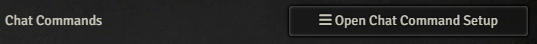
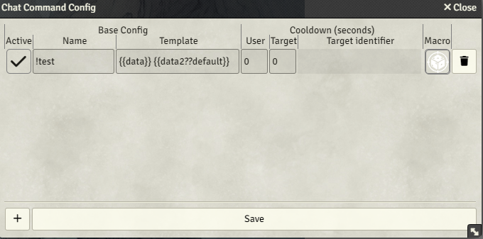
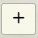
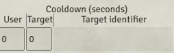

# Chat Commands (Deprecated)

::::warning

**This feature is deprecated and has been replaced by [Triggers](triggers).**

Chat commands functionality is still available but the backend will require an active subscription in the future. We recommend migrating to the new Triggers system to keep using this functionality for free.

::::

Chat commands are one of the ways that users can interact directly with foundry from your chat.

However, they are a bit more technical and require a base understanding of JavaScript.

They can be set up via their own menu in module settings.

## Creating a chat command

Chat commands can be created and configured in the chat command config UI.

To create a new command, click on the  button.

This will create a new command with no content in the list above.

The first thing you want to set is the Name. As seen in the example image at the start of the section, any prefixes have to be included in the name as this will be used to determine if a command has been executed.

The second thing that needs to be set up for a command is the Macro.
Similar to the Polls, chat commands can be used to execute macros as the GM. However, using either Advanced Macros or Foundry V11, you can pass arguments to those macros from the chat message.

## Setting up the Template

The Template is what dictates how the chat message is going to be evaluated and which variables will contain the data in the macro.

The syntax for the template is straightforward.
Entries are separated by spaces.
Any entry corresponding to an input to be evaluated by the macro is wrapped in double curly braces ``{{ }}``
and can optionally contain double question marks exactly once ``??`` to denote the text after as the default value.
These special characters are reserved and may not be used for naming or default values.
Single curly braces and single question marks, however, are fine.

Let's set up an example template entry: ``{{player??Player 1}}``.

This entry, when the command it is part of is executed by a chat user.
Will take any text at the same position in the command as itself
and give that text to the macro in the variable ``scope.player``.
If there is no text that corresponds to the template part, the macro will instead receive ``Player 1``.
If no default value is given, the scope variable will instead receive an empty string.

A complete chat command may look like this:

Name: ``!inspire``
Template: ``{{token??Trogdor the Burninator}} {{amount}}``

If a viewer now types ``!inspire Fizzlebang 2`` into the chat.
The macro will be executed,
the variable ``scope.token`` will receive the value ``Fizzlebang`` and the variable ``scope.amount``
will receive the value ``2``.
In this example, it is important to note that even numerical values will be passed to the macro as strings.

If a viewer instead types ``!inspire`` the macro will still execute.
In this case,
``scope.token`` will be evaluated as ``Trogdor the Burninator`` and ``scope.amount``
will be evaluated as an empty string.

### Reserved Names

The module automatically populates some names:

"user" and ``scope.user`` respectively will always be overwritten by the username of the person who ran the command

"isSubscribed" and ``scope.isSubscribed`` respectively will always be overwritten by if the user is a Subscriber on Twitch or a Channel Member on YouTube.

## Execution Cooldown

It's possible to set a cooldown for how often a given user can execute the macro.

These limits are stored in the memory of the browser that is used for the GM client and will NOT be kept during a reload.

Cooldowns are always given as seconds, however, since timekeeping is based on milliseconds; fractional values do work.

### Per User Cooldown

The first option for a cool down is to set it per user.

In this case,
the username will be stored together with the command name
and any execution will be prevented if the user has already invoked the same command in the second interval specified.

### Per Target Cooldown

In some cases, it might be desirable to have the cooldown not apply to chat users but instead to in-game characters.

To do so, specify the cooldown amount as you usually do and then specify just the name of the template part that contains your target.

This can also be left empty, which would result in a universal cooldown on the entire macro, regardless of who last executed it and who it was executed on.

The system will also treat different capitalization of the same target as different targets.

## Migrating to Triggers

We recommend migrating your chat commands to the new [Triggers](triggers) system. The functionality is similar, but the configuration is different:

1. Create a new Trigger for each of your existing chat commands
2. Set up a Chat Command event for each Trigger
3. Enter all your command aliases in the "command list"
4. Assign the same macro that was used for your chat command

The context data provided to the macro is compatible with the previous chat commands system, so your existing macros should continue to work without modification.