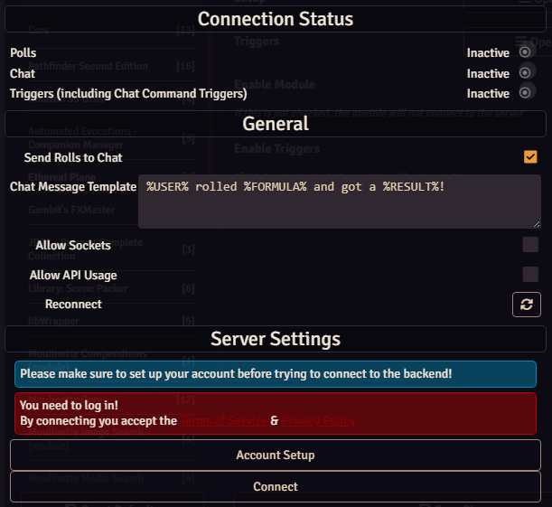

# MidiQoL Support

This module has full MidiQoL Support;
however, due to the complicated nature of MidiQoL's functionality, an extra step is required.

Go to Module Settings and open the Setup Menu.

Once here, you want to check the Option "Allow Sockets" on the bottom of the General tab.

This will allow the clients to evaluate their MidiQoL roll data and send the resulting chat message information to the GM Client to be broadcast to stream chat.

Please be aware that this would theoretically allow a malicious player to manually craft a "Roll" filling any text they want into the %\USER% %\FORMULA% and %\RESULT% section. Enable this feature at your own discretion.

