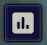
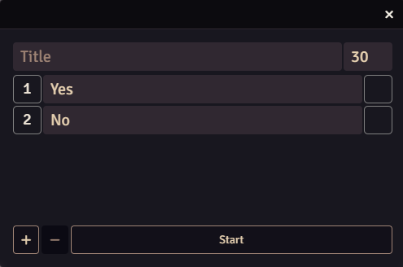
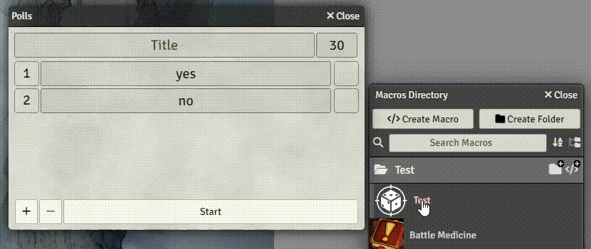
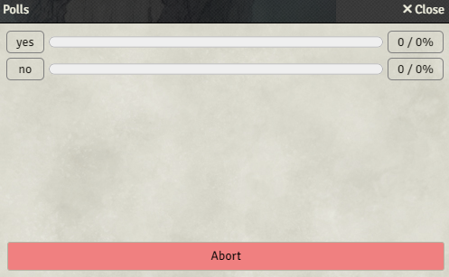

# Polls

The Poll feature is one of the ways you can allow your chat to interact with your Foundry game directly!

Polls are accessed via the sidebar button in the "Tokens" 

 section of the UI.

## Setting up Polls

You can set up the Poll in this UI:

You can give the Poll any Title, this is recommended if you use Twitch via the Patreon Mode.

It's possible to set up to five options for viewers to vote on.
With their respective option text.
The ID number of the option is fixed and cannot be changed.

You can also set the duration of the Poll in seconds. If using Twitch in Patreon Mode, setting it to a number below 30 or above 300 may cause the poll to fail.

Finally, you are able to attach Macros to the poll options.
To do so, drag and drop the Macro onto the little box next to the poll option.

If a poll concludes successfully, the macro attached to the winning option will be executed.

If there is a tie, the macro of the tied option with the lower number will be executed. So if there is a tie between option 2 and option 5, the Macro of option 2 will be chosen and the macro of option 5 will be discarded.

The macros will be executed as the GM with no target information given to them.

You can also quickly edit an attached macro by left-clicking it in the box, and remove it entirely by right-clicking it.

## Running a Poll

Once the Poll is set up, press "Start" to run it.

If you use Twitch via Patreon Mode, a Twitch Poll will appear for all viewers to vote on. Vote results are sent back to you in real time, so no need to monitor the results on twitch.

In any other mode, users have to type the number of the vote option into chat to vote for it.
Votes are ensured to be counted only once per viewer, and only the most recent choice will be counted.

The poll will automatically end after the set time limit.

## Aborting a Poll

While the poll is running, you can at any time cancel it by hitting the red "Abort" button.

This will end the poll, including the twitch poll if one is running, display the final results but NOT execute any macros.

## Overlay

This module also has an integration with OBS-Utils. If both are installed, Ethereal Plane will add an Overlay in the /stream view that will also contain the results of a given poll.
