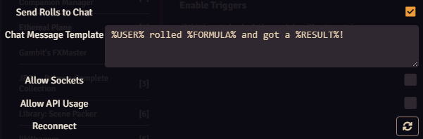
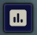
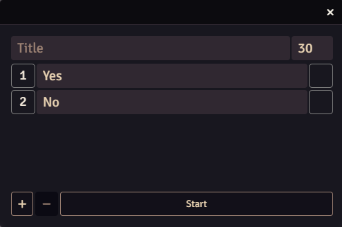

# Quick Start

You want to use Ethereal Plane but don't know how to get started?

This short Guide will help you take your first steps with Ethereal Plane.

Since the Module is subject to change in active development, please note that the screenshots might be outdated.

## Setting up the Module

After you have installed the Module, the first thing you need to do to make it work is go to module settings.

Once there, you will be greeted with this screen:

Here, you can open the Setup Menu and the Trigger Setup. You can also enable the Module and separately, select if triggers should be processed.

Before the Module can work properly, you need to open Setup.

### Setup

#### Connection

To begin using Ethereal Plane, you have to connect your foundry installation to the Ethereal Plane server.

To do so, you first need to create an account on the Etheral Plane website. You can quickly open it by clicking "Account Setup".

Then, once your account is created, you can connect to the server by clicking "Connect".

This will ask you to confirm that you want to add your foundry installation as a Client to your account. You only need to do this step once for each Foundry Installation, even if other people want to log into Ethereal Plane on your Foundry Instance.

::::info
Connecting write a small text file to the module's data folder. It contains a long string of characters that is used to identify your foundry to the ethereal plane server. Please do not remove this file or you will have to connect again.
::::

#### Logging in

Once your installation is connected, you can log in to Ethereal Plane by clicking "Login".

That will open this window.

You need to enter this code on the Ethereal Plane website to log into your Ethereal Plane account.

You can do so by either scanning the QR code, Copying the URL and pasting it manually, or clicking "Open" to directly open the URL in a new window.

Please make sure that the code entered on the website matches the code displayed in the window. If it doesn't, you can manually enter the code from the window into the website.

From there, confirm the code and log into your account if required. Once you are done, the login window in foundry will automatically close and you are ready to use Ethereal Plane.

::::info

The login code is only valid for a limited time. If you take too long you might have to close the window and try logging in again.

::::

#### Status Monitors

The top of the Setup Menu has a set of 3 status monitors that show if your module is connected to either of the three real time data endpoints that Ethereal Plane provides.

Polls will only be active and connected if a Poll is running.

Chat will only be active and connected if a direct chat read connection is used. Please note that even if you use Chat Command triggers or are sending messages to chat, this will remain disconnected.

Triggers will only be active and connected if you are using the Triggers feature.

## Send Rolls to Chat

You've successfully completed the first step of the setup!

The first feature to configure is the one that sends rolls to chat.
This will grab any roll that is not private or whispered and broadcast it to your stream chat.

To enable or disable it, check or uncheck the respective box.

You can also edit the Chat Message Template. You can put anything here!

When a roll occurs, the text `%\USER%` is replaced by the player's display name, `%\FORMULA%`
is replaced by the roll formula (i.e. `1d20+4+2`) and `%\RESULT%` is replaced by the roll result.

## Polls

In the configuration section for the Local Server or the Patreon Server, you can enable or disable Polls. 

If Polls are enabled,
a new icon  will appear in the Token Sidebar on the left.

Clicking on it will bring up the Poll Menu.

In here, you can set up a Poll with options and a title, define the duration and drag and drop macros into the little boxes next to the option name.

More on Polls can be found in the in-depth tutorial.

## Triggers

Triggers are a powerful new feature that replaces Chat Commands. They allow you to create interactive elements for your stream that can execute macros in Foundry VTT.

There is an in-module menu to assign macros to channel points, with import and export buttons in the window frame.

Triggers can also be configured through the web interface at [https://etherealplane.app](https://etherealplane.app).

For more detailed information, check out the [Triggers](triggers) documentation.

## Wrapping up

Now that you have made all your choices and set up your module, the last step is to enable it.

This will reload your page and start the Module once the reload is complete!