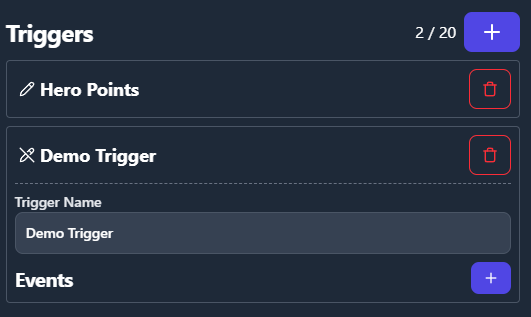
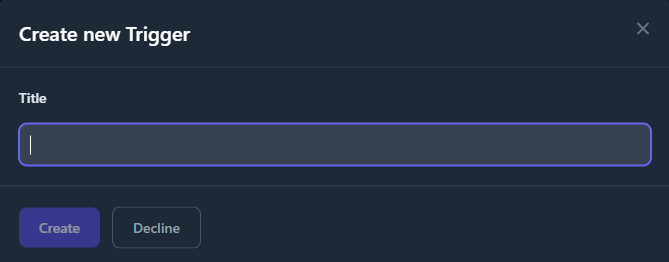
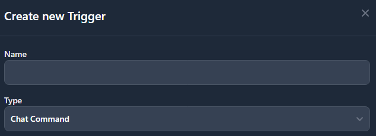
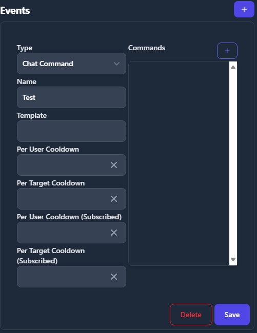
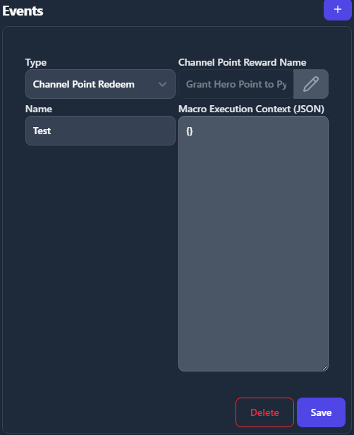
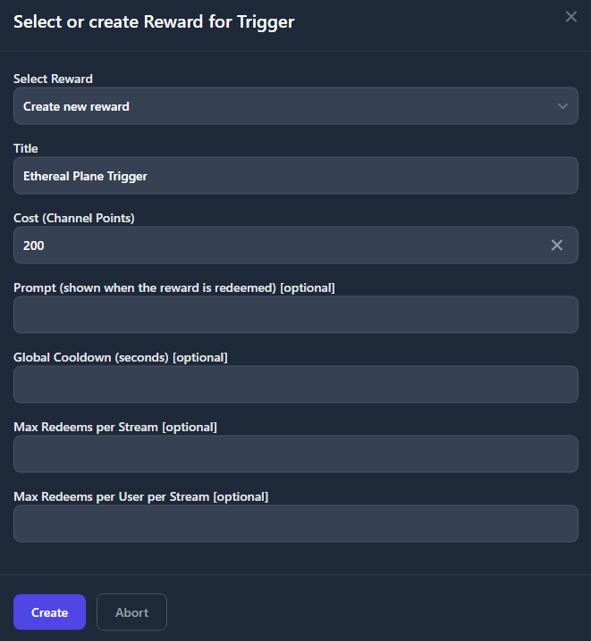

# Triggers

Triggers are a powerful feature that allows users to create interactive elements for their stream. They replace the deprecated chat commands functionality with a more flexible and comprehensive system.

## Understanding Triggers and Events

A Trigger is a discrete unit of execution that will be sent to Foundry VTT to execute a macro. It will receive execution context similar to how chat commands worked.

An Event is something that happens on stream that causes a trigger to be triggered.

## Setting up Triggers in Foundry VTT

Triggers macros are configured directly within the Ethereal Plane module in Foundry VTT.


There is an in-module menu to assign macros to channel points. The menu also includes import and export buttons in the window frame, allowing you to save and share your trigger configurations.

## Web Configuration

Triggers must be configured through the web interface at [https://etherealplane.app](https://etherealplane.app).



### Creating a New Trigger

The web config has a button to create a new trigger, which will open a dialog to set the name and create the trigger.



### Editing a Trigger

After creating a trigger, you can click the "pencil" icon to edit it. This allows you to:
- Edit the trigger name
- Remove the trigger
- Add a new event



## Event Types

There are two types of events that can trigger your macros:

### 1. Chat Commands

Chat commands work similarly to the deprecated chat command feature. However, the "alias" list is now the "command list" and all commands need to be entered here in order to be recognized instead of just alternative aliases.



Chat commands have context data that is given to the macro when they are executed, allowing your macros to respond dynamically to user input.

#### Setting up the Template

The Template is what dictates how the chat message is going to be evaluated and which variables will contain the data in the macro.

The syntax for the template is straightforward.
Entries are separated by spaces.
Any entry corresponding to an input to be evaluated by the macro is wrapped in double curly braces ``{{ }}``
and can optionally contain double question marks exactly once ``??`` to denote the text after as the default value.
These special characters are reserved and may not be used for naming or default values.
Single curly braces and single question marks, however, are fine.

Let's set up an example template entry: ``{{player??Player 1}}``.

This entry, when the command it is part of is executed by a chat user.
Will take any text at the same position in the command as itself
and give that text to the macro in the variable ``scope.player``.
If there is no text that corresponds to the template part, the macro will instead receive ``Player 1``.
If no default value is given, the scope variable will instead receive an empty string.

A complete chat command may look like this:

Name: ``!inspire``
Template: ``{{token??Trogdor the Burninator}} {{amount}}``

If a viewer now types ``!inspire Fizzlebang 2`` into the chat.
The macro will be executed,
the variable ``scope.token`` will receive the value ``Fizzlebang`` and the variable ``scope.amount``
will receive the value ``2``.
In this example, it is important to note that even numerical values will be passed to the macro as strings.

If a viewer instead types ``!inspire`` the macro will still execute.
In this case,
``scope.token`` will be evaluated as ``Trogdor the Burninator`` and ``scope.amount``
will be evaluated as an empty string.

#### Chat Command Context Data

When a Chat Command triggers a macro, it provides context data to the macro. Below is the structure of this context data, represented in TypeScript format for JavaScript developers:

```typescript
interface ChatCommandEventData {
    macro_arguments: {
        // for each template entry
        template_part: string;
    };
    raw_message: string;  
    message_overflow: string[];  
    message_parts: string[];  
    user: string;  
    is_subscribed: boolean;

}
```

##### Explanation of Fields:

- **`macro_arguments`**: A collection of data extracted from the input via the template
- **`raw_message`**: The complete unprocessed message input by the user in chat.
- **`message_overflow`**: A list of additional substrings of the message that couldn't fit into `message_parts` if the message is too long.
- **`message_parts`**: The main parts of the message split by the application's logic (e.g., command name, arguments, etc.).
- **`user`**: The username of the user that sent the message.
- **`is_subscribed`**: A boolean flag indicating whether the user is a channel subscriber.

### 2. Channel Point Redeem (Patron Feature)

Available to subscribed patrons, this event type allows you to use a Twitch channel point reward to trigger an event.



You can also set a macro execution context, which is a plain JSON object that will be given to the macro when this trigger is executed.
The JSON will be passed directly to the macro and will be available as ``scope`` in the macro context

Using the edit icon, users can create or reconfigure the channel point reward attached to this trigger.




## Migrating from Chat Commands

If you were previously using Chat Commands, you'll need to migrate your commands to the new Triggers system. The functionality is similar, but the configuration is different:

1. Create a new Trigger for each of your existing chat commands
2. Set up a Chat Command event for each Trigger
3. Enter all your command aliases in the "command list"
4. Assign the same macro that was used for your chat command

The context data provided to the macro is compatible with the previous chat commands system, so your existing macros should continue to work without modification.