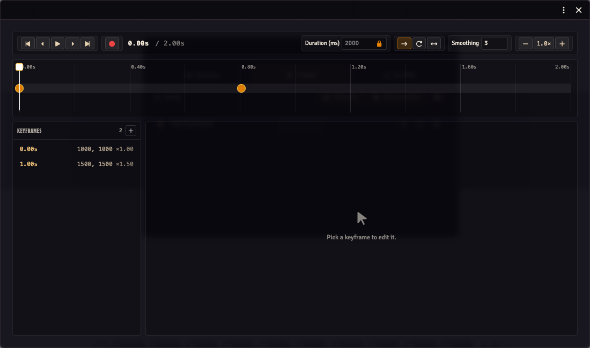

# Camera Keyframes

5.1 expanded camera presets from single-waypoint snapshots into full **keyframed sequences** — a timeline of camera positions with per-segment easing, played back as a smooth animated camera move.

The legacy single-waypoint presets still work; nothing changes for them.

## Preset shapes

There are two preset shapes now:

- **Legacy waypoint** — a single `{ x, y, scale }`. Applies instantly when triggered (with the existing camera-smoothing easing).
- **Keyframed sequence** — an array of `keyframes`, each with `{ time, x, y, scale, easing }`. Plays back as a tween through the keyframes in time order.

Both shapes coexist in the same preset list per scene.

## Editor

Open the **Director** (toolbar button on the scene controls). Switch to the **Presets** tab.

Each animation-preset row has a **pen-to-square (edit) icon** on the right. Clicking it opens the keyframe editor in a separate ApplicationV2 window (`obs-utils-animation-preset`, 880×520).



### Adding keyframes

When the editor is expanded on a keyframed preset:

- The timeline strip across the top shows the duration scale and the keyframes as draggable dots.
- The **playhead** is a vertical line; click on the timeline to move it.
- **+ Add keyframe at playhead** captures the current canvas viewport at the playhead's time. Pan the canvas to where you want the camera to be at that point, then click the button.

### Editing a keyframe

Click a marker to select it. The detail panel below the timeline shows:

- **Time** (ms) — drag the marker on the timeline or edit the input.
- **X / Y / Scale** — the camera position at this keyframe.
- **Easing** — the curve used to interpolate FROM the previous keyframe TO this one. Options: linear, easeIn/Out/InOut, power1/2/3 in/out/inOut, sine variants, back variants.
- **Capture from viewport** — replace this keyframe's x/y/scale with whatever the current canvas viewport is.
- **Delete keyframe** — remove the selected keyframe. The first and last keyframes can't be removed (they bookend the sequence).

### Loop mode

The loop dropdown at the top of the panel:

- **None** — plays once, stops at the last frame
- **Restart** — loops back to the first keyframe and replays
- **Ping-pong** — reverses direction each cycle

### Playback controls

- **▶ Play** — runs the sequence, animating the canvas viewport along the timeline. The playhead follows.
- **⏹ Stop** — halts playback and disposes the timeline.

## Runtime

The sequence runtime uses GSAP (provided by Foundry's global). Each segment between consecutive keyframes becomes a `gsap.to` call on a viewport proxy; the `onUpdate` callback feeds the interpolated position into the canvas via the existing camera-smoothing infrastructure.

Custom cubic-bezier easings are supported via a built-in cubic-bezier evaluator (no CustomEase plugin dependency).

## Programmatic playback

There are two API methods for preset playback, with different scopes:

- **`playPreset(preset)`** (`void`) — the broadcast path. Claims active-GM control, switches both tracking-mode slots to `cloneDM`, pauses the DM's outgoing viewport stream, and broadcasts the preset to every OBS client. Use this when you want the production camera to move.
- **`previewPreset(preset)`** (`SequenceController`) — local-only, no side effects. Animates the GM's own canvas without touching tracking state or broadcasting anything. Returns a controller with `pause()`, `resume()`, `scrub(ms)`, and `stop()`. Use this when auditioning a sequence in the editor.

```js
const api = game.modules.get('obs-utils').api;

// Broadcast to OBS — no return value
api.playPreset(preset);

// Preview locally — full controller
const controller = api.previewPreset(preset);
controller.pause();
controller.scrub(1500);
controller.resume();
controller.stop();
```

For legacy single-waypoint presets, both methods short-circuit to the existing `clampAndApplyExternal` path; `previewPreset` returns a no-op controller in that case.

## Keyboard shortcuts

These shortcuts apply inside the keyframe editor window (opened via the pen-to-square icon on an animation preset row).

### Playback

| Input | Action |
|-------|--------|
| Click ▶ Play | Play from the current playhead position. |
| Ctrl/Cmd+click ▶ Play | Play from the start of the sequence regardless of playhead position. |

### Timeline navigation

| Input | Action |
|-------|--------|
| Click on the timeline strip | Move the playhead to that position. |
| Ctrl/Cmd+drag on the timeline strip | Draw a time-range lasso. All keyframes whose time falls inside the range are selected when you release. |
| Click prev/next keyframe button | Jump to the immediately previous or next keyframe. |
| Ctrl/Cmd+click prev keyframe button | Jump to the very first keyframe. |
| Ctrl/Cmd+click next keyframe button | Jump to the very last keyframe. |
| Ctrl/Cmd+click a keyframe dot on the timeline | Select that keyframe and pull the playhead to its time — handy for "go here, then play". |
| Ctrl/Cmd+click a stacked-keyframe badge | Cycle selection through the stacked keyframes (same as a plain click) and pull the playhead to the newly selected keyframe's time. |
| Ctrl/Cmd+scroll wheel | Zoom the timeline in or out. |

### Keyframe list (sidebar)

| Input | Action |
|-------|--------|
| Click a row | Select that keyframe (clears any existing multi-selection). |
| Ctrl/Cmd+click a row | Toggle that keyframe in or out of the multi-selection. |

### Nudging selected keyframes

When one or more keyframes are selected, you can nudge them in time with the arrow keys. The step size depends on the modifier held:

| Keys | Step |
|------|------|
| ← / → | 1 ms |
| Ctrl/Cmd+← / → | 10 ms |
| Shift+← / → | 100 ms |

### Deleting keyframes

| Keys | Action |
|------|--------|
| Backspace | Delete the selected keyframe(s). |

Note: the Delete key is captured by Foundry's canvas layer for deleting tokens; use Backspace inside this editor.
