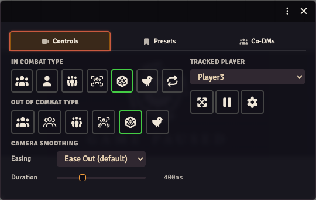

# Getting Started

## Install

Use Foundry's Module Installer to add **OBS Utils**, then enable it in your world's Module Management.

## Set up your OBS browser source

Create a Browser Source in your OBS scene and point it at your Foundry server. The URL has two flavors:

- `https://your-foundry.example/game` — the standard game-board view
- `https://your-foundry.example/stream` — a chromeless stream view that renders only the overlays

Use the OBS Interact button to log in inside the source. If you want to use both views in one scene, create both sources and toggle visibility so only one is connected at a time.

## OBS Mode

The browser source needs to be in **OBS Mode** so Foundry hides chrome, mutes audio, etc. There are three ways to enter OBS Mode (settings in the OBS Utils config):

| Setting | What it does | When to use |
|---|---|---|
| **Pin This Browser to OBS Mode** | Client-side toggle. Every tab in the same browser stays in OBS Mode forever. | Last-resort for unusual setups — locks you in until you disable it. |
| **Designate User as OBS Client** | World setting. The chosen user is always treated as the OBS source no matter which browser they log in from. | Most common path: create a dedicated `OBS` user and pick it here. |
| **Force OBS Mode on /stream** | Always renders overlays on the `/stream` page regardless of user. | If your scene only uses `/stream`. |

There's also a **Disable OBS Mode for Everyone** kill-switch if a user accidentally pins themselves in.

OBS Browser Sources autodetect and enter OBS Mode automatically — you don't need to flip anything for those.

## Basic settings

In the world config:

- **Minimum / Maximum Scale** — bounds for camera zoom on the OBS view (relative to the scene's background size).
- **Pop-up Close Delay** — seconds before automatically closing a journal or image popout that the GM opened.
- **Show Combat Tracker in Combat** — toggles the combat tracker sidebar visibility on the OBS view during a combat encounter.

Watch the [Basic Setup tutorial](https://www.youtube.com/watch?v=JbWA9kARx0U) for a visual walkthrough (predates V5 but the connection steps are unchanged).

## The Director

The Director is the GM-side control panel for the OBS view. Open it via the Scene Controls button (the broadcasting-signal icon in the Token tools).

It has three tabs:

### Controls

The day-to-day controls. Pick a camera-tracking mode for in-combat and out-of-combat, plus a target player if relevant.

| Mode | Behavior |
|---|---|
| Track Owned Tokens | Follow tokens owned by the OBS user. |
| Track Active Owned Token | Follow the current-turn token if it's owned by the OBS user. |
| Clone Selected Player | Mirror whatever player is picked in the Tracked Player dropdown. |
| Clone Active GM | Mirror the active GM's viewport (see [Multi-GM Handover](./multi-gm.md) for what "active" means with multiple GMs online). |
| Clone Turn Player | Mirror the current combat turn player's viewport. |
| Fit Map to Scene | Zoom out to fit the entire scene. |

Below the mode radios, the Camera Smoothing section gives you an easing curve and a duration (0–1500ms) for camera tweens. All tracking modes use this — pans are no longer abrupt.

There are also toggle buttons for **Limit Canvas to Edges**, **Pause Camera Tracking**, and a **Force-Open OBS Settings** button (sends a Foundry settings dialog open command to the OBS client over socket).

### Presets

See [Scene Camera Presets](./scene-presets.md).

### Co-DMs

See [Multi-GM Handover](./multi-gm.md).
