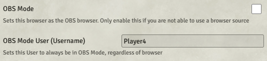

# Manual OBS Mode

OBS Browser Sources autodetect and enter OBS Mode automatically — you don't need any of the below for the common case. These three settings exist for setups where the browser source isn't recognised (custom embeddings, non-OBS browsers viewing `/game` or `/stream`, etc.).

| Setting | Scope | Effect |
|---|---|---|
| **Pin This Browser to OBS Mode** | Client | Every tab in this browser stays in OBS Mode until disabled. |
| **Designate User as OBS Client** | World | Whatever browser this user logs into is treated as the OBS source. |
| **Force OBS Mode on /stream** | World | Render overlays on the `/stream` page regardless of who's logged in. |

There's a fourth setting that acts as a kill-switch:

- **Disable OBS Mode for Everyone** — overrides all three of the above. Useful if a user accidentally pins themselves into OBS Mode and can't find their way out.

## Keyboard escape hatch

| Keybinding | Action |
|------------|--------|
| Ctrl+Shift+Alt+O | Disable OBS Mode — turns off the **Pin This Browser** client setting so the page returns to the normal Foundry UI. |

A page refresh is needed after triggering this shortcut. The binding is editable in Foundry's **Configure Controls** settings.

## With Websocket

When using Manual OBS Mode with the OBS browser source, you'll still need to provide OBS Websocket credentials — either via the [OBS Remote → Connection tab](./obs-remote.md#connection-tab) or via the browser source's Custom CSS.
