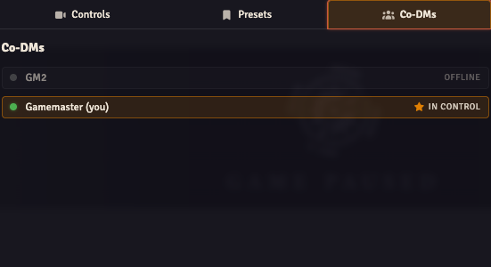

# Multi-GM Co-DM Handover

When multiple GM accounts are online (a primary GM plus one or more Co-DMs), OBS Utils designates exactly one as the **active GM**. That's whose viewport gets mirrored by `Clone Active GM` mode on the OBS view.

## The Co-DMs tab

Open the Director and switch to the **Co-DMs** tab. It lists every GM-permissioned user in the world with their online status:

- **Online + active** — gold "in control" badge with a star icon.
- **Online + not active** — for your own row, a **Take Active** button appears.
- **Offline** — greyed out with an "offline" tag.

Click **Take Active** on your own row to claim the active seat. OBS Utils negotiates a handover with the current active GM over socket and:

1. Reads the previous active GM's current viewport.
2. Snaps your canvas to that viewport via `clampAndApplyExternal` — the position is applied synchronously, with no eased pan.
3. Writes the `activeGMUserId` world setting to your user ID.
4. From this point on, your pans drive the `Clone Active GM` mirror.

The `cameraTrackingMode` setting (`raw` / `smooth` (default) / `dragRelease`) controls how the new active GM's viewport events are smoothed before they reach OBS observers. See [Director API](./director-api.md) for details on reading and writing Director state.

## Who's active by default?

If `activeGMUserId` is unset or points to an offline user, OBS Utils falls back to the first online GM in the world's user list. The first GM to log in is typically active until someone explicitly claims it.

## Empty state

The Co-DMs tab shows a friendly empty state when only one GM-permissioned account exists in the world. The handover mechanism doesn't apply unless there are at least two GMs to swap between.
