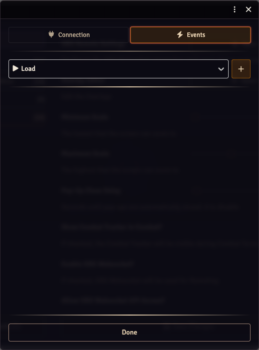
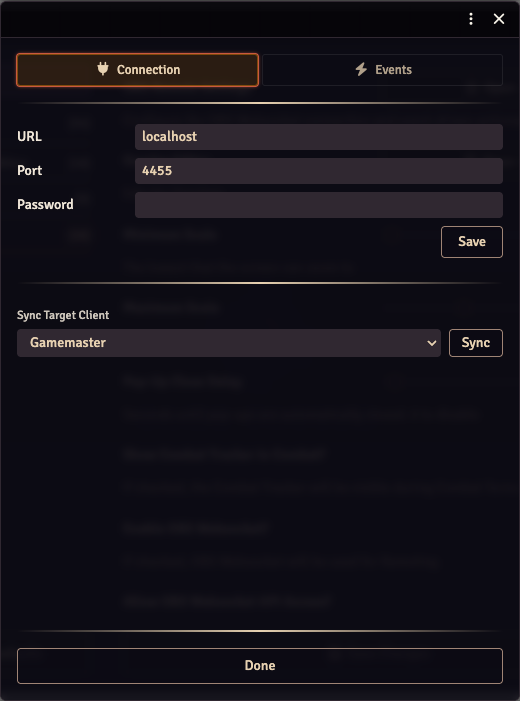

# OBS Remote

OBS Remote lets you tie Foundry events to OBS actions — switch scenes when combat starts, toggle a "round timer" source when the round changes, stop recording on `core.onStopStreaming`, etc.

Watch the [OBS Remote tutorial video](https://www.youtube.com/watch?v=wnCPbJ1eHRs) for a visual guide (pre-V5; the new menu is described below).

## Caveats

OBS Browser Sources expose a minimal API automatically — only scene switching and start/stop recording or streaming. For the full feature set (source toggles, audio control, anything else), you need **OBS Websocket V5** installed inside OBS itself.

OBS Remote runs in the OBS browser source, so it only acts on the `/game` view by default. Use `/stream` directly if your scene only has the chromeless overlay view.

## The combined menu

In V5 the OBS Remote menu and the old OBS Websocket Settings menu have been merged. There's one entry now — **Module Settings → OBS Remote Settings** — with two tabs.



### Connection tab



Enter your OBS Websocket URL, port, and password. The **Save** button persists; the **Sync** button below pushes the local credentials to whichever user is selected in the dropdown (the typical flow: configure on the GM machine, sync to the OBS user).

You have two options for the credentials:

1. **In-Foundry**: enter them here. Stored in the world settings.
2. **In OBS browser source CSS**: paste the following block into your Browser Source's *Custom CSS* field and they override whatever Foundry has stored:

   ```css
   :root {
     --local-obs-host: localhost;
     --local-obs-port: 4455;
     --local-obs-password: P4ssw0rd!;
   }
   ```

   No quotes, no spaces; keep the trailing semicolons. You can override only some — e.g. just the password.

The Websocket Master Setting (**Enable OBS Websocket?**) still lives in Module Settings; the new menu doesn't change that toggle.

### Events tab

Pick an event type from the dropdown and add **actions** (or, for events with conditions, **instances**, each with their own action list).

#### Built-in event types

| Key | Fires |
|---|---|
| `core.onLoad` | When Foundry first loads on the OBS client. |
| `core.onCombatStart` | First turn of round 1 of any new combat. |
| `core.onCombatEnd` | Combat is deleted. |
| `core.onPause` | Game paused. |
| `core.onUnpause` | Game unpaused. |
| `core.onSceneLoad` | A scene is viewed. Has a `sceneName` condition — only fires actions configured for a matching scene name. |
| `core.onStopStreaming` | OBS Websocket reports streaming stopped. Hidden unless OBS Websocket is enabled. |

#### Conditions

Event types may declare a schema of condition fields. The editor renders the schema as inputs — text fields for strings, number fields for numbers, checkboxes for booleans.

Example: `core.onSceneLoad` has a `sceneName` condition. You can have multiple **instances** of `core.onSceneLoad`, each watching for a different scene name, each with its own action list.

#### Available actions

| Action | Needs Websocket? | Notes |
|---|---|---|
| Switch Scene | No (browser-source API) | Enter the OBS scene name. |
| Toggle Source | Yes | Enter the OBS scene name + source name. |
| Enable Source | Yes | Same. |
| Disable Source | Yes | Same. |

Actions fire in sequence in the order configured.

## Custom event types via API

Third-party modules can register their own event types — see [API: OBS Remote events](./api.md#obs-remote-events). The editor picks them up alongside the built-ins, with no editor changes needed.
