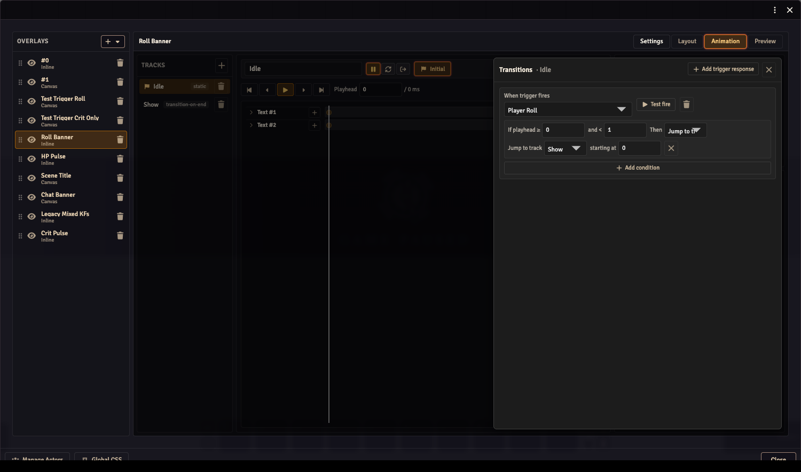
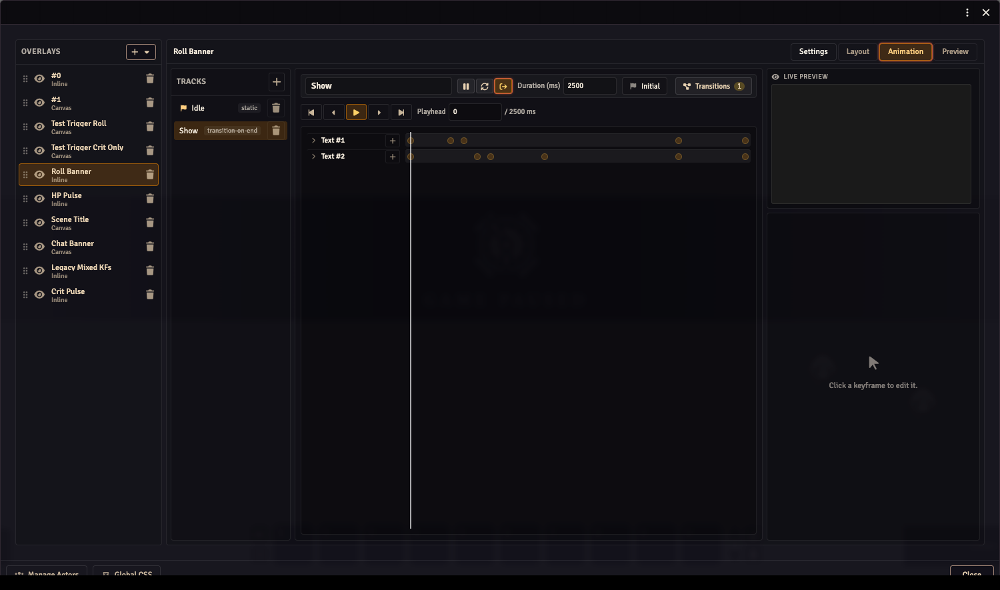

# Overlay Animations

The animation system lets overlays move, fade, and react to triggers through a **track-based** model. An overlay holds a set of named tracks, and the playback engine drives which track is active and where the playhead sits within it.

## Data model

An overlay's `animation` field stores an `OverlayAnimationData` object:

```ts
{
  tracks: OverlayTrack[];
  initialTrackId: string;
  transitions: TrackTransition[];
}
```

`initialTrackId` points to the track that plays when the overlay first mounts. If `animation` is absent, the overlay is fully ambient — no playback, no transitions.

### Tracks

Each `OverlayTrack` carries:

| Field | Type | Description |
|-------|------|-------------|
| `id` | `string` | Stable UUID. |
| `name` | `string` | Display label shown in the editor. |
| `durationMs` | `number` | Length of the track in milliseconds. `0` is valid for static tracks. |
| `behavior` | `TrackBehavior` | What the engine does when playback reaches the end. |
| `lanes` | `TrackComponentLane[]` | Per-component keyframe data. |

`TrackBehavior` is one of:

- `{ type: 'static' }` — no playback; the engine evaluates the track at `t = 0` and holds.
- `{ type: 'looping' }` — plays forward, then wraps back to `t = 0` and repeats.
- `{ type: 'transition-on-end'; toTrackId: string; toTime: number }` — when the playhead reaches `durationMs`, the engine jumps to `toTrackId` starting at `toTime`.

### Lanes

A `TrackComponentLane` targets one component by `componentId` and stores its keyframes. The current format uses per-property arrays:

```ts
{
  componentId: string;
  propertyKeyframes: Partial<Record<AnimatablePropertyKey, PropertyKeyframe[]>>;
}
```

The six animatable properties are:

| Key | Default |
|-----|---------|
| `opacity` | `1` |
| `x` | `0` (delta from the component's layout position) |
| `y` | `0` (delta from the component's layout position) |
| `rotation` | `0` (degrees) |
| `scaleX` | `1` |
| `scaleY` | `1` |

A `PropertyKeyframe` is `{ t: number; v: number; easing?: EasingV2 }` where `t` is milliseconds from the start of the track (not a 0..1 offset).

The legacy `keyframes: TrackKeyframe[]` mixed-property shape is still loaded from persisted data and round-trips correctly — the engine converts it at evaluation time.

### Easing

`EasingV2` controls the curve between two keyframes:

```ts
{
  interpolation: 'constant' | 'linear' | 'bezier';
  equation?: EasingEquation;
  direction?: 'in' | 'out' | 'inout' | 'auto';
}
```

`'constant'` snaps to the previous value at the destination keyframe. `'linear'` interpolates with no curve. `'bezier'` applies a named equation:

`sinusoidal` · `quadratic` · `cubic` · `quartic` · `quintic` · `exponential` · `circular` · `back` · `bounce` · `elastic`

The interpolator is a pure-TypeScript implementation built into obs-utils. There is no GSAP dependency.

## Transitions

A `TrackTransition` describes how the overlay reacts when a named trigger fires while a given track is playing:

```ts
{
  triggerKey: string;
  fromTrackId: string;
  zones: TransitionZone[];
}
```

Each `TransitionZone` covers a time window on the track:

```ts
{
  startT: number;           // inclusive, in ms
  endT: number;             // exclusive, in ms
  destination: ZoneDestination;
}
```

`ZoneDestination` is either:

- `{ type: 'goto'; toTrackId: string; toTime: number }` — jump to the given track at the given time in milliseconds.
- `{ type: 'ignore' }` — discard the trigger and continue playing.

When a trigger fires, the engine checks which zone's `[startT, endT)` range contains the current playhead and executes that zone's destination. For `static` tracks (where `durationMs` is `0` and there is no meaningful playhead position), the engine falls back to `zones[0]` if no zone matches.

### Typical pattern

A common two-track setup has an idle track (`static`, no keyframes) and an active track (`transition-on-end` back to idle). A transition on the idle track maps the trigger to `goto(activeTrack, 0)`. The active track plays through, then `transition-on-end` returns to idle automatically — no timer, no duration field on the overlay itself.



## Authoring UI

Animation is one of the four **mode tabs** in the Composer workspace header (Settings / Layout / Animation / Preview). Selecting the Animation tab shows:

**TracksPane (left column)** — lists all tracks for the current overlay. Click a track to select it. The initial track is marked; right-click or use the kebab menu to set a different track as initial, rename, or delete.

**Center column** — contains two stacked areas:
- **TrackBar** — shows the selected track's name, behavior, duration, and playback controls (play / stop / step-frame / jump-to-keyframe). The badge showing the transition count opens the TransitionsDrawer.
- **KeyframeTimeline** — horizontal scrubber with per-property keyframe rows for every component in the overlay. Click to position the playhead; click a keyframe diamond to select it. Drag to move a keyframe in time.

**Right column** — stacked:
- **LivePreview** — renders the overlay at the current playhead position as you scrub or play back, so you can see the animation without leaving the editor.
- **KeyframeInspector** — shows the selected keyframe's time, value, and easing controls. When a component row is selected (not a specific keyframe), shows per-property value inputs and diamond toggle buttons for inserting or removing a keyframe at the current playhead position.

**TransitionsDrawer (slide-in)** — opens from the transitions badge on the TrackBar. Lists all `TrackTransition` entries for the selected track and lets you add, remove, and configure them. Each transition entry shows the trigger dropdown, the zone list (each zone has a start time, end time, and destination picker), and the end-of-track behavior when `behavior.type` is `transition-on-end`.



If the overlay has no `animation` yet, the workspace shows an introductory placeholder with a **Set up animation** button that seeds an empty `OverlayAnimationData` with one static idle track.

## Keyboard shortcuts

These shortcuts are active while the **Animation** workspace tab is open.

### Timeline navigation

| Input | Action |
|-------|--------|
| Click on the timeline background | Move the playhead to that position. |
| Ctrl/Cmd+drag on the timeline background | Draw a lasso rectangle. All keyframe markers the rectangle intersects become selected when you release the mouse. |
| Drag a selected marker | Move that keyframe in time. |
| Drag when multiple markers are selected | Move all selected keyframes together. |

### Prev/next keyframe buttons

The step-backward and step-forward buttons in the TrackBar advance the selection by one keyframe at a time.

| Input | Action |
|-------|--------|
| Click prev/next button | Jump to the immediately previous or next keyframe. |
| Ctrl/Cmd+click prev button | Jump to the very first keyframe. |
| Ctrl/Cmd+click next button | Jump to the very last keyframe. |

### Nudging with arrow keys

When a keyframe is selected, the left and right arrow keys move it in time. The size of each step depends on the modifier held:

| Keys | Step |
|------|------|
| ← / → | 1 ms |
| Ctrl/Cmd+← / → | 10 ms |
| Shift+← / → | 100 ms |

### Deleting keyframes

| Keys | Action |
|------|--------|
| Backspace or Delete | Delete the selected keyframe (or all keyframes in the current multi-selection). |

## `tileBy` and triggered overlays

The `tileBy` field on `OverlayData` controls how many instances the renderer creates:

| Value | Behavior |
|-------|----------|
| `'actors'` | One tile per actor in the bound actor list. Default for ambient overlays like HP bars. |
| `'players'` | One tile per non-GM user currently active. The trigger payload is routed to the tile whose `user.id` matches the event source. |
| `'users'` | One tile per active user including GMs. |
| `'once'` | A single instance regardless of context. |

Triggered overlays (those with transitions out of the idle track) typically use `tileBy: 'players'` so each player sees their own overlay react to their roll. This is set on the **Settings** workspace tab — see [Stream Composer](./overlay-editor.md).
