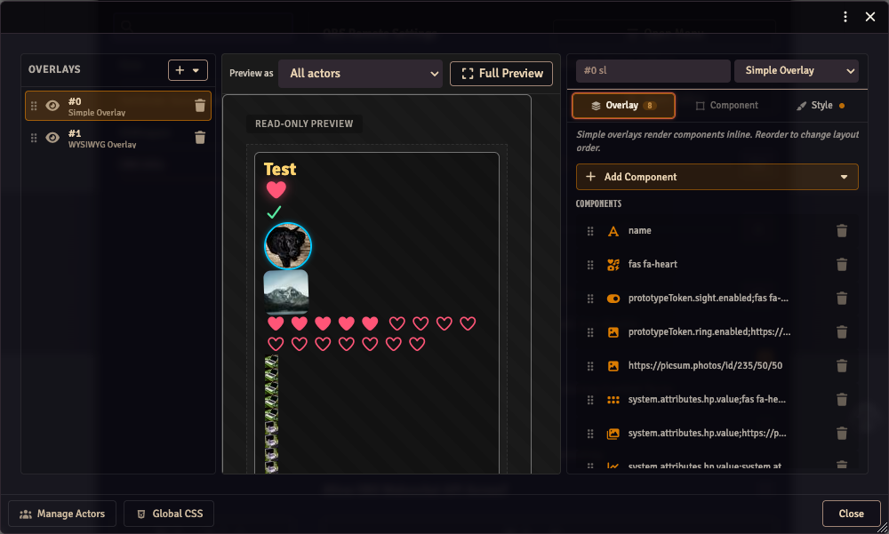
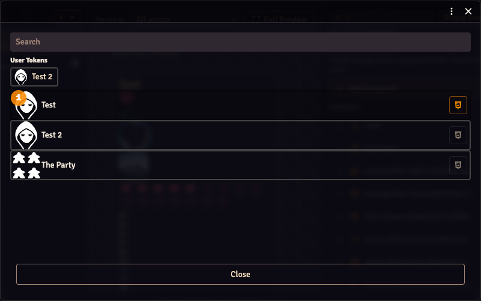
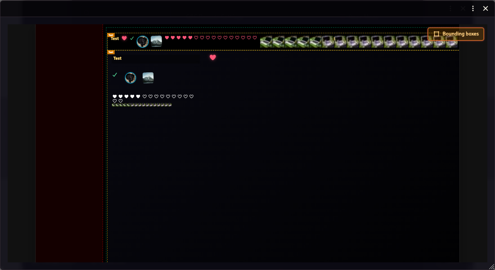

# Stream Composer

The Stream Composer is the overlay editor, opened from Module Settings → **Overlay Editor**. It's a three-pane layout where overlays are organised as a layered list and one is in focus at a time.

## Concepts

- An **overlay** is a layer attached to a list of actors. The same overlay renders one copy per selected actor.
- Each overlay has a **type**: **Simple** (inline-flex row of components), **WYSIWYG** (absolutely-positioned components on a fixed-resolution canvas), or **Roll** (per-player roll display).
- Each overlay contains **components**: plain text, FA icon, image, boolean AV icon, boolean AV image, multi-icon AV, multi-image AV, progress bar.

## Three panes

### Layers (left)

Lists every overlay. Each row has:

- A **drag handle** for reorder.
- A **visibility toggle** — disabled overlays render with a strike-through name and a `HIDDEN` chip and are skipped on `/stream`.
- The overlay's **name** (editable inline).
- A type tag (`SL`, `WYSIWYG`, `ROLL`).
- A delete button.

The **+** button at the top opens an Add menu — pick an overlay type to create a new layer.

The footer carries two utility buttons:

- **Manage Actors** — pick which actors the overlays render for. Includes a User Tokens row of quick-select chips for any user-assigned characters, a search box, and per-actor CSS buttons.

  
- **Global CSS** — opens the [global CSS editor](./stream-overlay-css.md).

### Canvas (center)

Previews the selected overlay at its native reference resolution.

**WYSIWYG** overlays are interactive:

- Click a component to select it (resize handles appear).
- Drag to move it; data commits on release.
- Drag a corner/edge handle to resize.
- Arrow keys nudge 1px (Shift+Arrow = 10px).
- Escape deselects, Tab cycles through components.

**Simple** and **Roll** overlays render as read-only previews. The Roll preview has an inline **Test** button that runs the pre/roll/post animation with a random value so you can iterate on timing and visuals.

### Properties (right)

Tabbed:

- **Overlay** — layer-level config (name, type, optionally width/height for WYSIWYG) and the component list.
- **Component** — auto-switches to this tab when you click a component on the canvas. Shows the component's data picker (e.g. an actor-value path picker, an image picker for image components) and other type-specific knobs.
- **Style** — see [Custom CSS](./stream-overlay-css.md). Has Easy (form fields) and Advanced (raw CSS) modes that edit the same underlying field.

## Full Preview

Click **Show Full Preview** in the canvas header to open a separate window that renders every overlay × actor at 1920×1080 reference resolution, fit to the window. A semi-transparent dead-zone shows where Foundry's chat sidebar would block the OBS view on `/stream`.

The Full Preview toolbar has a **Bounding boxes** toggle that outlines each rendered overlay copy with a label showing the actor name (or player name for roll overlays). Useful for confirming layout before going live.

## Adding components

In the Overlay tab on the right, the **+ Add Component** button opens a popover (rendered fixed-position so it escapes the pane's scroll) with the registered component types. Selecting one appends it to the current overlay and switches the right pane to the Component tab on that new component.

## Reorder + draw order

For WYSIWYG overlays, the component-list order is the draw order — first in the list draws first (lowest z). Drag rows to reorder.

## Import / export

The Overlay Editor's window controls expose **Import** and **Export** buttons (top-right header). Exports are JSON files with a `version: 2` schema. Imports accept both v2 and v1 exports — v1 files have stable IDs back-filled at load. Older versions of OBS Utils refuse v2 exports.
