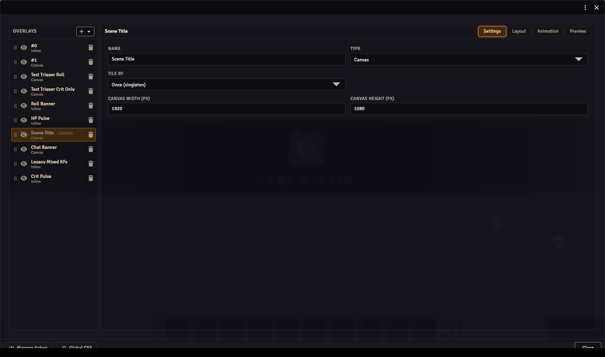
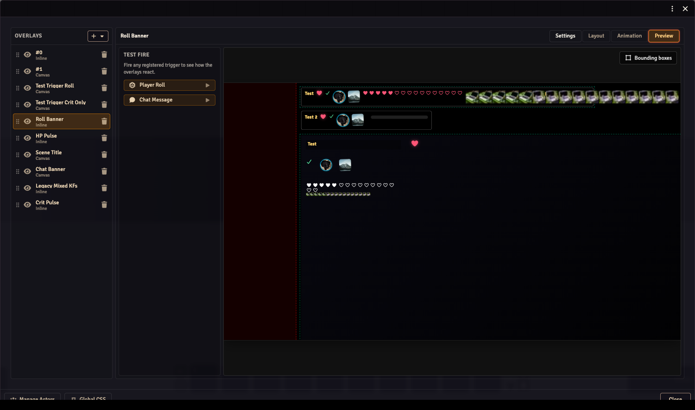

# Stream Composer

The Stream Composer is the overlay editor, opened from Module Settings → **Overlay Editor**. It is a two-column layout: a narrow **Layers panel** on the left lists every overlay in the world, and a **Workspace pane** on the right fills the rest of the window.

## Concepts

- An **overlay** is a layer attached to a list of actors. The same overlay renders one copy per selected actor (or per player, or once — see [tileBy](#settings-workspace) below).
- Each overlay has a **type**: **Inline** (`sl` on disk — inline-flex row of components) or **Canvas** (`wysiwyg` on disk — absolutely-positioned components on a fixed-resolution canvas). The legacy Roll overlay type was removed in 5.1 and is now expressed as a Canvas overlay with a transition-based animation — see [Overlay Animations](./overlay-animations.md).
- Each overlay contains **components**: plain text, FA icon, image, conditional icon, conditional image, icon counter, image counter, progress bar.

## Layers panel (left)

Lists every overlay. Each row has:

- A **drag handle** for reorder.
- A **visibility toggle** — disabled overlays render with a strike-through name and a `HIDDEN` chip and are skipped on `/stream`.
- The overlay's **name** (editable inline).
- A type tag.
- A delete button.

The **+** button at the top opens an Add menu — pick a blank overlay type or choose from any registered templates.

The footer carries two utility buttons:

- **Manage Actors** — pick which actors the overlays render for. Includes a User Tokens row of quick-select chips for any user-assigned characters, a search box, and per-actor CSS buttons.

  
- **Global CSS** — opens the [global CSS editor](./stream-overlay-css.md).

## Overlay Templates splash

When the world has no overlays yet, the Composer shows the **Overlay Templates** splash instead of the normal two-column layout. It presents a grid of template cards (HP Bar, Name Plate, Status Icons, Custom Canvas, Custom Inline, and any templates registered by companion modules). Picking one creates the overlay from the template and drops you straight into Layout mode. The splash disappears as soon as at least one overlay exists.

## Workspace modes

The workspace header shows the selected overlay's name on the left and four **mode tabs** on the right: **Settings**, **Layout**, **Animation**, **Preview**. Switching tabs changes what fills the workspace pane.

### Settings workspace

The Settings workspace is where you configure overlay-level properties:

- **Name** — the display label shown in the Layers panel and in the workspace breadcrumb.
- **Type** — **Inline** or **Canvas**. Changing type on an overlay that already has components shows a confirmation dialog since the component position or rendering data may be discarded.
- **Tile by** — controls how many instances the renderer creates:
  - **Actors** — one copy per actor in the bound actor list (default).
  - **Players** — one copy per non-GM user currently active. Use this for triggered overlays that react per-player (e.g. roll banners).
  - **Users (incl. GM)** — one copy per active user.
  - **Once (singleton)** — a single instance regardless of context.
- **Canvas width / Canvas height** — pixel dimensions of the reference canvas (Canvas overlays only). Components are positioned relative to these dimensions.

### Layout workspace

The Layout workspace is a two-column view inside the workspace pane: a **canvas area** on the left and a **Properties panel** on the right.

**Canvas area**

Previews the selected overlay at its native reference resolution. A per-overlay **Preview as** dropdown in the canvas header lets you filter the canvas to a single actor instead of showing all bound actors at once.

Canvas overlays are interactive:

- Click a component to select it (resize handles appear).
- Drag to move it; data commits on release.
- Drag a corner or edge handle to resize.
- Arrow keys nudge 1 px (Shift+Arrow = 10 px).
- Escape deselects; Tab cycles through components.

Inline overlays render as a read-only preview.

**Properties panel**

The Properties panel is a single scrollable pane. It shows the component list at the top (drag rows to reorder, click a row to select a component) and the selected component's editor inline below it. Component list order is draw order for Canvas overlays — first in list draws first (lowest z).

Clicking **+ Add Component** opens a popover (rendered fixed-position so it escapes the pane's scroll) with the registered component types. Selecting one appends it to the overlay and selects it.

At the bottom of the component section there is a **Style** button that opens a slide-in drawer with the component's custom CSS editor. The same drawer is also reachable for the overlay itself (not a component) from the component list header. See [Custom CSS](./stream-overlay-css.md) for the full authoring flow.

### Animation workspace

The Animation workspace is a full-height mode for building keyframe tracks and trigger transitions. It is described in detail on the [Overlay Animations](./overlay-animations.md) page.

In brief: a TracksPane on the left lists tracks; the center column contains the TrackBar and KeyframeTimeline; the right column shows a LivePreview that scrubs in real time as the playhead moves, plus the KeyframeInspector for editing individual keyframes. A slide-in TransitionsDrawer lets you configure which trigger fires cause the overlay to jump between tracks.

### Preview workspace

The Preview workspace lets you fire triggers and watch all overlays react without leaving the Composer.

The left side is a **fire panel** listing every registered trigger. Clicking a trigger button fires it immediately with a mock payload (for `core.onPlayerRoll`, a random d20 value; for `core.onChatMessage`, a test message using the first configured actor). The right side renders a full overlay preview identical to what the OBS browser source would show.

This replaces the need for a separate preview window — it lives inside the same Composer window as the other mode tabs.

## Picker groups

The actor-value picker (used wherever you wire a component to a data path) renders **grouped options** when a companion system module is installed. For example, `obs-utils-dnd5e` groups paths into Combat / Abilities / Skills / Spells / etc. Without a companion module, the picker shows a flat list derived from the actor schema.
