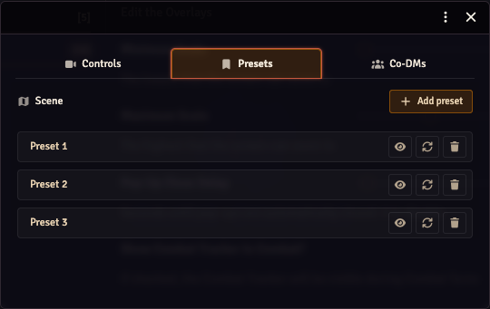

# Scene Camera Presets

Per-scene saved viewports — quick-jump locations you can recall during a session.

## The Presets tab

Open the Director and switch to the **Presets** tab. The header shows the current scene's name; below it, your list of presets for *this scene*.

## Lifecycle

- **Add**: pan/zoom to the position you want, click the **+ Add** button. The current viewport is saved as `Preset N`.
- **Apply** (eye icon): pans the camera to the preset's position with the configured easing/duration.
- **Update** (refresh icon): overwrites the preset's position with the current viewport.
- **Delete** (trash icon): removes the preset.
- **Rename**: click the name field and edit inline.

## Storage

Presets are stored per scene on the scene document's flags, under `flags['obs-utils'].cameraPresets`. The flag is a JSON string wrapping a versioned object so the schema can evolve. Switching scenes refreshes the Presets tab automatically — no need to reopen the Director.

Each preset has:

- A stable UUID `id`.
- A `name`.
- `x`, `y` (rounded to integer pixels).
- `scale` (preserved as a float).
