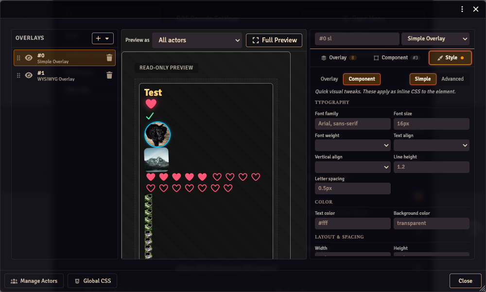

# Custom CSS

OBS Utils supports custom CSS at four scopes. Rules are injected into managed `<style>` tags that mount only while an overlay renderer is alive — they don't pollute Foundry's UI when the editor is closed.

Watch the [Stream Overlay tutorial video](https://www.youtube.com/watch?v=XdpdAU-raUU) for a visual guide on the older API (pre-V5; the four-scope model below replaces it).

## DOM structure

The renderer produces this structure inside each overlay container (`.overlay-renderer`):

```html
<div class="obs-utils overlay">
  <div class="actor" id="actor{actorID}" data-actor-name="{Display Name}">
    <div class="actor-layer" data-actor-name="...">
      <div class="overlay{index}" data-overlay-id="{stable-id}">
        <div data-component-id="{stable-id}">
          <div class="component {component-type}" id="component{index}">
            <!-- per-type contents -->
          </div>
        </div>
        ...
      </div>
    </div>
  </div>
</div>
```

The IDs in `data-overlay-id` and `data-component-id` are stable UUIDs that survive reorder. Use those for scoped CSS — the array-index `id="overlay0"` etc. are convenient but shift when you reorder.

## The four scopes

| Scope | Selector wrap | Edit where | Survives reorder |
|---|---|---|---|
| **Global** | `.overlay-renderer { ... }` (auto-applied) | Overlay Editor footer → Global CSS | n/a |
| **Per actor** | `#actor{id} { ... }` | Manage Actors → CSS button on the row | yes (actor ID) |
| **Per overlay** | `[data-overlay-id="..."] { ... }` | Style tab → Advanced when an overlay is selected | yes (stable UUID) |
| **Per component** | `[data-component-id="..."] { ... }` | Style tab → Advanced when a component is selected | yes (stable UUID) |

The Global scope is auto-wrapped in `.overlay-renderer` so a careless rule like `.app { color: red }` can't bleed into Foundry's chrome or another module's DOM. The other three are scoped by construction.

## Simple vs Advanced

Each `customCSS` field has a **Simple** mode (form fields) and an **Advanced** mode (raw CSS textarea). Both edit the same underlying data:

- **Simple** parses the CSS into known fields grouped under Typography / Color / Layout & Spacing / Border / Image. The Image group only appears on image-rendering component types (`img`, `bavimg`, `mimgav`).
- Anything Simple can't represent — nested rules, pseudo-elements, unknown declarations — is preserved verbatim and shown in a read-only "Preserved CSS" summary at the bottom of Simple mode.
- **Advanced** shows the same CSS string raw. Edits round-trip into Simple's fields on switch.



### Nested rules and pseudo-elements

For Simple Overlay components, the `data-component-id` wrapper uses `display: contents`, so layout properties (padding, background, width) won't apply to it directly. To style the inner element, use a nested selector:

```css
i { color: gold; font-size: 22px; }
img { border-radius: 50%; }
progress { width: 240px; height: 14px; }
progress::-webkit-progress-value { background: linear-gradient(90deg, #f55, #ff5); }
```

Inheritable properties like `color` and `font-*` still propagate through `display: contents`, so they work at the top level.

WYSIWYG component wrappers are real positioning elements — top-level layout properties work directly.

## Lifecycle

The `<style>` tags (`obs-utils-css-global`, `obs-utils-css-actors`, `obs-utils-css-overlays`, `obs-utils-css-components`) are mounted when an overlay renderer activates and removed when the last renderer unmounts. Active renderers are:

- `OverlayRenderer` on `/stream`
- `OverlayPreviewUI` (Full Preview window)
- `Composer` (the overlay editor's canvas pane)

You won't find these style tags in the document on `/game` unless one of those is open. The OBS browser source keeps them mounted as long as `/stream` is loaded.
